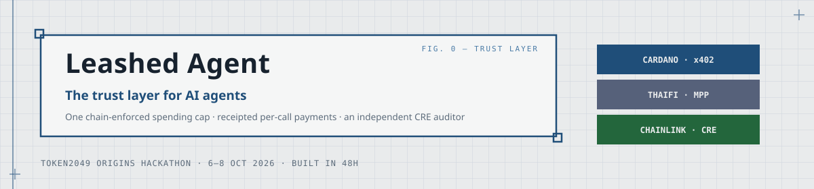
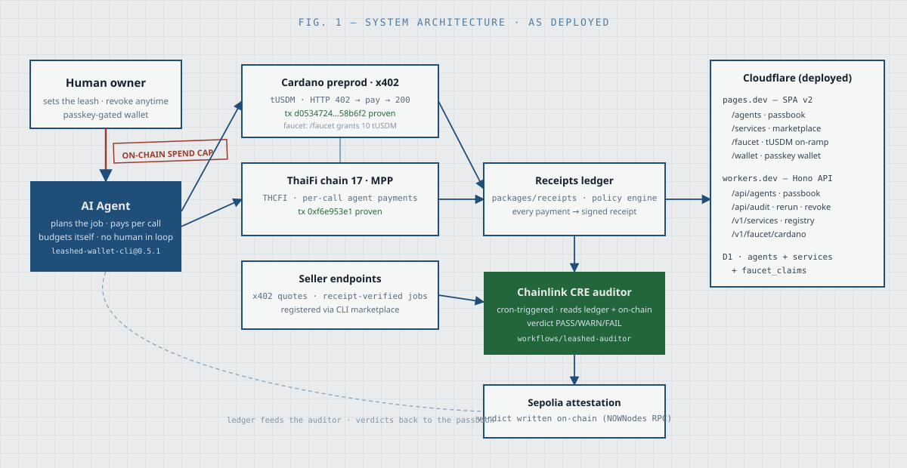

<div align="center">



[](https://leashed-agent-platform.pages.dev)
[](https://leashed-api-agents.poom-a1d.workers.dev/api/healthz)
[](https://www.npmjs.com/package/leashed-wallet-cli-platform)
[](LICENSE)

**TOKEN2049 Origins Hackathon · Singapore · Oct 2026**
Main track ($100K AWS) · Cardano Agentic Commerce · Chainlink Best Workflow with CRE · NOWNodes Multichain Infrastructure

</div>

---

AI agents can now **hire themselves out and pay for their own tools**. Nothing about that is safe by default: an agent with a wallet will eventually spend wrongly, get scammed by a dishonest endpoint, or drift outside its mandate.

**Leashed Agent is the safety layer.** A human sets a spending cap in an on-chain leash contract. The agent plans jobs and pays per call across two chains — every payment leaves a signed receipt. An independent **Chainlink CRE workflow** audits the receipts against the chain and writes its PASS/WARN/FAIL verdict to Sepolia. The human watches a passbook, not a terminal — and pulls the leash anytime, without trusting the agent or the endpoints it deals with.

> **Principle: the agent is quarantined by construction.** The cap is enforced by a smart contract, not a prompt. The receipts are audited by a workflow the agent doesn't control. Revocation is instant and on-chain.



---

## 🎮 Try it in 60 seconds

| | |
|---|---|
| **Platform** | [leashed-agent-platform.pages.dev](https://leashed-agent-platform.pages.dev) — agent passbooks, marketplace, and the **faucet** |
| **Faucet** | [/faucet](https://leashed-agent-platform.pages.dev/faucet) — paste a Cardano preprod address, receive **10 real tUSDM + 5 tADA** on-chain (24h/address) |
| **Wallet** | [/wallet](https://leashed-agent-platform.pages.dev/wallet/) — passkey-only fork of the ThaiFi wallet; create a wallet in your browser, no email, no seed |
| **Marketplace** | [/services](https://leashed-agent-platform.pages.dev/services) — the x402 services agents buy, live from the registry |
| **API** | [healthz](https://leashed-api-agents.poom-a1d.workers.dev/api/healthz) · [/v1/services](https://leashed-api-agents.poom-a1d.workers.dev/v1/services) · [/v1/agents](https://leashed-api-agents.poom-a1d.workers.dev/api/agents) |

**One-command local demo** (agent job → seller probe → CRE audit → passbook):

```bash
bash scripts/demo.sh
```

**The CLI agents actually use** ([npm](https://www.npmjs.com/package/leashed-wallet-cli-platform)):

```bash
npm i -g leashed-wallet-cli-platform
leashed agent deploy --name poster --budget 5   # deploy an agent under a 5-token leash
leashed agent run --brief "post an ad"          # pays the seller per call, receipts every cent
leashed agent revoke                            # kill the leash instantly
```

## 🔗 What's real on-chain

| Claim | Proof |
|---|---|
| Cardano preprod x402 payment (tUSDM) | [tx `5e796a4c…bdc0`](https://preprod.cardanoscan.io/transaction/5e796a4cce249e021ad694283bec298eae0add25cbb31a106b6cca1379efbdc0) · [`docs/m2-cardano-evidence.md`](docs/m2-cardano-evidence.md) |
| Faucet transfer (lucid-built, 1 tUSDM + 1.5 tADA) | [tx `d0534724…58b6f2`](https://preprod.cardanoscan.io/transaction/d0534724f12f1f910685bffa45200556c85dec7e2cf7ed13371b3f5fad58b6f2) — block 5,261,421 |
| ThaiFi chain-17 agent payment (THCFI) | [tx `0xf6e953e1…b65e`](https://exp.thaifi.com/tx/0xf6e953e17647cf5559455337552b82f93208d57cde8fa2d57ba9a80860f3b65e) — first real on-chain paid job (M1) |
| CRE audit verdicts | [`docs/cre-auditor-evidence.txt`](docs/cre-auditor-evidence.txt) — first-run FAIL caught a real accounting gap, now PASS |
| Sepolia attestation of the verdict | CRE workflow output, via NOWNodes RPC |

No mocks in the payment path. The faucet grants **real tUSDM on Cardano preprod** (Moneta's public CIP-99 testnet campaign), rate-limited per address in D1 — balances live on the chain, never in a database.

## 🏗️ Monorepo

```
leashed-agent/
├── apps/
│   ├── api-agents/        Hono worker — /api/agents · /api/audit · /v1/services · /v1/faucet/cardano
│   └── web-agents/        React 19 SPA — /agents passbooks · /services · /faucet   → Cloudflare Pages
├── packages/
│   ├── receipts/          Shared receipt schema + policy engine (chain-agnostic)
│   ├── payments-thaifi/   ThaiFi MPP rail adapter (chain 17)
│   ├── payments-cardano/  Cardano x402 rail adapter (preprod)
│   ├── wallet-fork/       Passkey-only fork of the ThaiFi wallet (Vite + React)
│   └── wallet-cli-fork/   leashed-wallet-cli-platform on npm — agent deploy/ls/run/revoke
├── workflows/
│   └── leashed-auditor/   Chainlink CRE workflow — cron-triggered audit → Sepolia
├── probes/                Feasibility probes; must pass before product code
└── docs/                  Evidence, design system, QA reports, deploy runbook
```

## 🛠️ Stack

**Cloudflare Workers (Hono) + D1** · **React 19 + Vite** · **Chainlink CRE** · **viem + lucid-cardano** · **TypeScript everywhere** · WebAuthn/passkeys

Deployed on Cloudflare's global edge; everything reproducible from this repo via [`DEPLOY.md`](DEPLOY.md).

## ✅ How it was tested

This repo ships with an **independent QA campaign**, not vibes. A separate checker agent ([Rakazo](https://agent.arisium.xyz)) ran scripted browser journeys against every release — 14 journeys + 6 exploratory charters, five rounds total. It **found 13 real defects** (broken deep links, a crypto writer bug proven at byte level, dark-theme regressions, a dead export flow), all fixed and re-verified. Final verdict: **PASSED, all journeys**.

- Task packets + full reports: [`.super-speckit/qa/`](.super-speckit/qa/)
- Runtime evidence: screenshots, console sweeps, on-chain tx hashes per journey

## 🎨 Design system

One visual language across platform and wallet: **Variant D — Archival Blueprint**. Drafting-blue ink on gridded paper, IBM Plex Sans + Roboto Mono, hairline ledger tables, corner crosshairs, `FIG. 1/2/3` schematic annotations. Defined in [`docs/design-sketches/`](docs/design-sketches/) — including full page-design sheets for the wallet.

## 🧭 Honest limitations

- The CRE audit is **cron-triggered and public-input**; it doesn't use Chainlink Confidential Workflows/TEE (documented decision — nothing in this system needs secret inputs).
- The wallet's cloud-backup endpoints live on the upstream wallet worker (different Cloudflare account); this fork degrades gracefully to device-only.
- Cardano legs run on **preprod**; ThaiFi legs on chain 17 testnet economics.

## 📄 License

MIT — see [LICENSE](LICENSE).

<div align="center">
<sub><b>Leashed Agent</b> · built in 48h by a solo builder at TOKEN2049 Origins, Singapore · <a href="https://leashed-agent-platform.pages.dev">try it live</a></sub>
</div>
